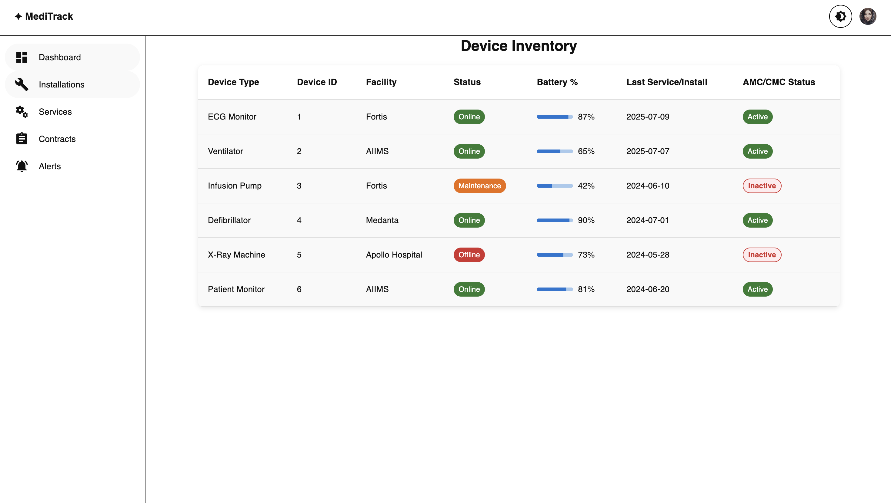
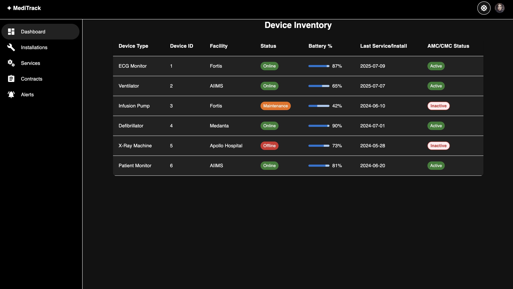
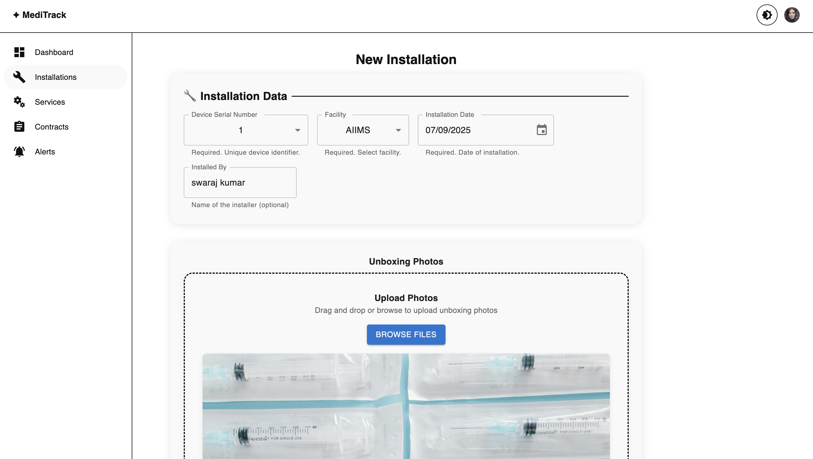
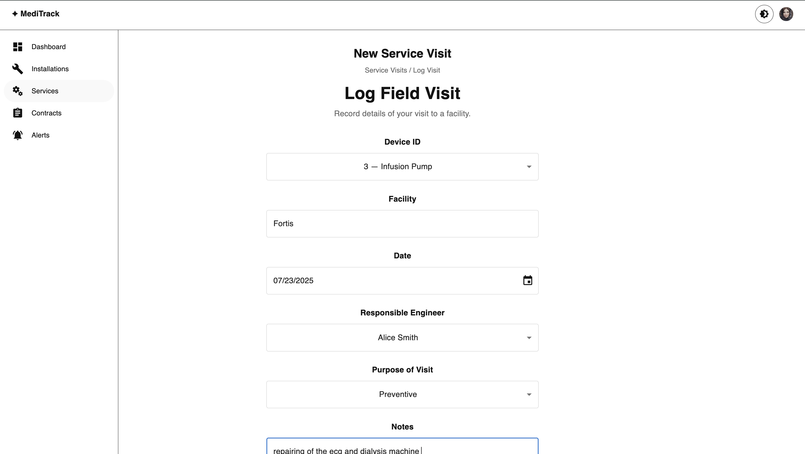
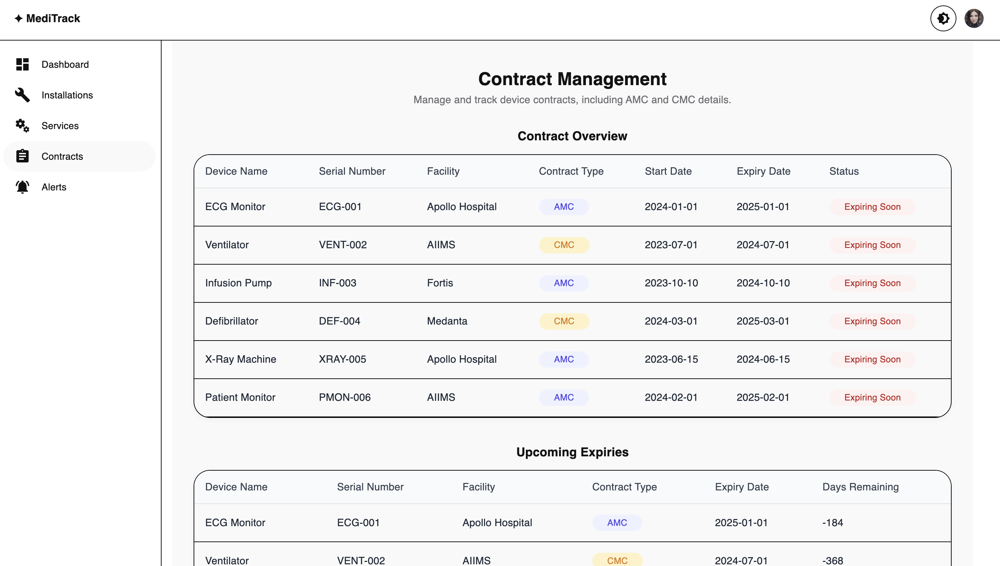
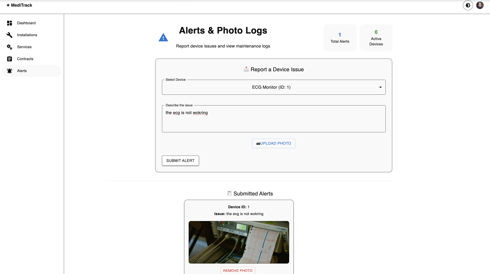

# Device CRM + Inventory Management Dashboard

A full-featured admin dashboard to manage medical device inventories, track installations, service visits, AMC/CMC contract lifecycles, and maintain facility-specific CRM histories—including training, feedback, and photo documentation.

**Live Demo:**  
Frontend: [https://device-crm-dashboard.vercel.app/](https://device-crm-dashboard.vercel.app/)  
Backend: [https://device-crm-api.onrender.com](https://device-crm-api.onrender.com)

**GitHub Repositories:**  
- Frontend: [https://github.com/swaraj29/DEVICE-CRM-DASHBOARD](https://github.com/swaraj29/DEVICE-CRM-DASHBOARD)  
- Backend: [https://github.com/swaraj29/device-crm-api](https://github.com/swaraj29/device-crm-api)

---

## Screenshots

| Device Inventory (Light) | Device Inventory (Dark) |
|:-----------------------:|:----------------------:|
|  |  |

| Installation (Unboxing) t | Service Visit | Contract Management |
|:-------------------:|:-------------:|:-------------------:|
|  |  |  |

| Alerts & Photo Logs|
|:----------------------:|
|  |

> _Screenshots: Device Inventory (light/dark), Contract Management, Service Visit, Alerts & Photo Logs, Installation Unboxing._

---

## Features

- **Device Inventory Dashboard:**  
  View all devices with type, ID, facility, status (Online/Offline/Maintenance), battery %, last service/installation date, and AMC/CMC status.
- **Installation & Training Module:**  
  Log new installations, upload unboxing photos, complete checklists, submit training forms, and track completion status. Modularized form sections for maintainability and extensibility.
- **Service Visit Logs:**  
  Log field visits with notes, date, responsible engineer, purpose (Preventive/Breakdown), and attachments (photos, PDFs). Robust validation for all required fields.
- **AMC/CMC Tracker:**  
  Track devices with AMC/CMC contract details, view upcoming expiries, and export reports to CSV.
- **Alerts & Photo Logs:**  
  Upload photos of device condition and handle alerts for issues during installation or maintenance.
- **Theme Switcher:**  
  Seamless light/dark mode with smooth transitions and accessible color schemes. All form fields, section headings, and popups are styled for both themes.
- **Export Reports:**  
  Export AMC/CMC and device data to CSV.
- **Form Validation:**  
  All major forms include robust validation (required fields, date checks, image upload checks, etc.) with user feedback via Snackbar.
- **Extensible Modular Codebase:**  
  Forms are split into modular sections (e.g., InstallationDataSection, ImageUploadSection, TrainingInfoSection, FormActions) for easy maintenance and extension.

---

## Tech Stack

- **Frontend:** ReactJS, Redux Toolkit, Material UI, SCSS Modules
- **State Management:** Redux Toolkit
- **Styling:** Material UI + CSS Variables for theme support, SCSS modules
- **Validation:** Custom logic (with option to extend using Yup/React Hook Form)
- **Mock API:** json-server or localStorage (for demo/testing)
- **Build Tool:** Vite

---

## Getting Started

### Prerequisites
- Node.js (v18+ recommended)
- npm or yarn

### Installation
```bash
git clone https://github.com/yourusername/device-crm-dashboard.git
cd device-crm-dashboard
npm install
```

### Running Locally
```bash
npm run dev
```
The app will be available at [http://localhost:5173](http://localhost:5173).

### Build for Production
```bash
npm run build
```

---

## Project Structure

```
/ (root)
├── public/
│   └── vite.svg
├── src/
│   ├── api/
│   │   ├── alerts.js
│   │   ├── apiConfig.js
│   │   ├── contracts.js
│   │   ├── devices.js
│   │   ├── installations.js
│   │   └── services.js
│   ├── assets/
│   │   └── react.svg
│   ├── components/
│   │   ├── AMCContracts/
│   │   ├── Alerts/
│   │   ├── Dashboard/
│   │   ├── Installations/
│   │   │   ├── InstallationDataSection.jsx
│   │   │   ├── ImageUploadSection.jsx
│   │   │   ├── TrainingInfoSection.jsx
│   │   │   └── FormActions.jsx
│   │   ├── Services/
│   │   │   ├── ServiceDataSection.jsx
│   │   │   ├── AttachmentUploadSection.jsx
│   │   │   └── FormActions.jsx
│   │   └── Shared/
│   ├── containers/
│   │   ├── AMCContracts.jsx
│   │   ├── Alerts.jsx
│   │   ├── Dashboard.jsx
│   │   ├── Installations.jsx
│   │   └── Services.jsx
│   ├── redux/
│   │   ├── store.js
│   │   └── slices/
│   │       ├── alertSlice.js
│   │       ├── contractSlice.js
│   │       ├── deviceSlice.js
│   │       ├── installationSlice.js
│   │       └── serviceSlice.js
│   ├── utils/
│   │   └── exportToCSV.js
│   ├── App.css
│   ├── App.jsx
│   ├── index.css
│   ├── main.jsx
├── .gitignore
├── eslint.config.js
├── index.html
├── package.json
├── package-lock.json
├── README.md
├── vercel.json
├── vite.config.js
```

- `src/components/Installations/` — Modularized installation form sections (data, image upload, training, actions)
- `src/components/Services/` — Modularized service visit form sections
- `src/containers/` — Page-level containers for each module
- `src/redux/` — Redux store and slices for device, facility, service, contract, and alert data
- `src/api/` — API utilities for CRUD operations (can be swapped for real or mock backend)
- `src/utils/` — Utility functions (CSV export, validation, etc.)
- `src/context/` — React context for theming
- `src/assets/` — Static assets (SVGs, images)

---

## Key Modules
1. **Device Inventory Dashboard**
2. **Installation & Training** (with modular, validated forms)
3. **Service Visit Logs** (with modular, validated forms)
4. **AMC/CMC Tracker**
5. **Alerts & Photo Logs**

Each module supports full CRUD operations, file uploads, and is fully responsive.

---

## Theming & Accessibility
- Uses CSS variables, SCSS modules, and Material UI theme palette for seamless light/dark switching.
- All major UI elements, form fields, section headings, and popups are styled for both themes.
- Fully mobile responsive: works great on phones, tablets, and desktops.
- Accessible color contrast and keyboard navigation.

---

## Validation & Extensibility
- All forms include robust validation for required fields, dates, and uploads.
- Validation logic is modular and can be extended (see `InstallationDataSection`, `ImageUploadSection`, etc.).
- User feedback is provided via Snackbar for all validation errors and successes.
- Easily extend forms by adding new sections/components and validation rules.

---

## Deployment
- **Frontend:** Deployed on Vercel — [https://device-crm-dashboard.vercel.app/](https://device-crm-dashboard.vercel.app/)
- **Backend:** [https://device-crm-api.onrender.com](https://device-crm-api.onrender.com)

---

## Mobile/Remote Testing with ngrok

You can use [ngrok](https://ngrok.com/) to expose your local frontend or backend for testing on mobile devices or from other networks.

- The Vite config (`vite.config.js`) is already set up to allow external access and whitelist your ngrok domain.
- Start your frontend with `npm run dev`.
- In a new terminal, run `ngrok http 5173` (for frontend) or `ngrok http 5000` (for backend).
- Access the ngrok URL from your mobile device or share it for remote testing.

This makes it easy to test your app on real devices or share with teammates for live feedback.

---

## Contributing
Pull requests are welcome! For major changes, please open an issue first to discuss what you would like to change.

---

## License
[MIT](LICENSE)

---
